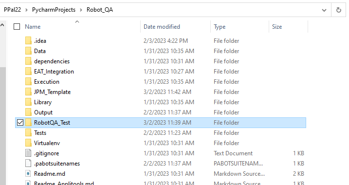

## Executing robot tests in JPM platform

If you want to setup your robot tests to execute in Jenkins as part of an existing JPM pipeline, follow the steps in https://sourcecode.jnj.com/pages/ASX-NCOH/robot_framework/browse/docs/#/user_guide/guidelines/rf_jpm_integration to add the configuration to the manifest.

Otherwise, if your project is a standalone Robot framework test repository, you can copy the contents of this folder to the root of your project to set up a JPM pipeline in Jenkins. The files will need to be adjusted for your project details.

The files are as follows:
- Copy all the files from JPM_Template folder and paste those to main project folder (not under any sub folder)
- Jenkinsfile - bootstrap file for JPM (no need to update)
- automation_pipelines.yaml - specifies the Jenkins environment to create the pipeline in (requires the jenkins team key of your project)
- _scm_jenkins/jenkins.yaml - specifies the bitbucket branch structures you wish to use in Jenkins (no need to update unless your project has different branching structure in bitbucket)
- environment-mapping.yaml - specifies the environments associated with your bitbucket branch names (no need to update unless your project has different environments)
- manifest-sources.yaml - specifies how the manifest.yaml file is processed (no need to update)
- manifest.yaml - configurations enabled in the common section will execute in all environments (branches), whereas configurations in in the 'environments' section of the file will only execute in the branch that Jenkins job is building from. For robot testing, the relevant section to be updated is regressionTest stage. For full details on how to configure this stage, please see https://sourcecode.jnj.com/pages/ASX-NCOH/robot_framework/browse/docs/#/user_guide/guidelines/rf_jpm_integration and for all supported manifest values go to [JPM docs for robot testing](https://sourcecode.jnj.com/pages/ASX-NAGH/jpm_shared_lib/develop/browse/docs/#/user-guide/jpm-pipelines/stages/robot-testing?id=supported-manifest-values-for-robot-testing).
- Under main project folder a new folder should be created and below mentioned folder should move to that folder
      - Data
      - dependencies
      - Execution
      - Library
      - Tests

Example shown below (we create 'RobotQA_Test' folder under main project folder move Data, dependencies,Execution,Library,Tests)

that newly created folder name should be mentioned as value of "projectTestFolder" parameter under manifest.yaml file

The JPM process is also documented in the XENA training guide (which includes a section on robot framework), and it is recommended for all users to carry out the self-service training in order to understand the processes in the pipeline manifest: https://sourcecode.jnj.com/pages/asx-xena/xena-training/main/browse/docs/#/130-Intro-to-JPM