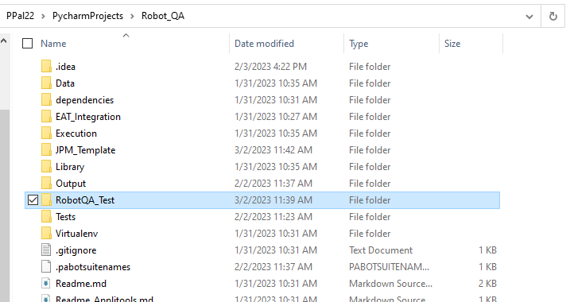
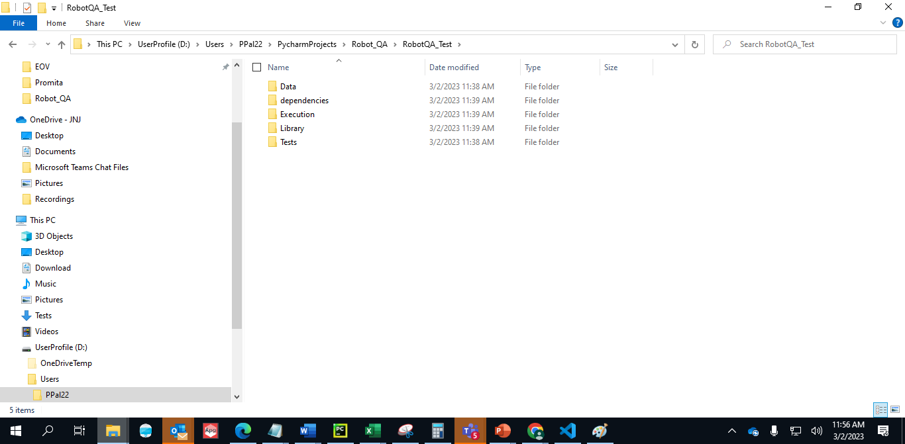

Project: <ProjectName> Robot Framework Version: <Version_Number>
==========================================================================================

## Integration with JPM

Robot Framework is fully integrated with **[JPM](https://jpmdocs.xena.dev)**.

To set up your project with JPM, please follow the [JPM Quick Start Guide](https://sourcecode.jnj.com/pages/ASX-NAGH/jpm_shared_lib/develop/browse/docs/#/user-guide/jpm-quick-start-guide?id=jpm-quick-start-user-guide), or the [XENA Training Course 140](https://sourcecode.jnj.com/pages/asx-xena/xena-training/main/browse/docs/#/140-Creating-JPM-Pipeline).

To set up and use robotFramework for regression/integration testing via JPM, please follow the JPM Docs for the **[Robot Test Automation Framework](https://sourcecode.jnj.com/pages/ASX-NAGH/jpm_shared_lib/develop/browse/docs/#/user-guide/jpm-pipelines/stages/robot-testing)**. 
You can also find a hands-on tutorial on the XENA training page **[Course 212](https://sourcecode.jnj.com/pages/asx-xena/xena-training/main/browse/docs/#/212-Robot-Framework-Automated-Test-Execution-via-JPM?id=lab-update-jpm-manifest)**.

A JPM_Template folder is provided containing the main pipeline files to help get started.

### **JPM Xray Upload**

Robot framework through JPM is fully integrated with Jira Xray.

As long as you provide the required `jiraProjectKey`, and a JIRA `credentialsId`, your tests will be automatically created in JIRA.

!>The credentials to access Jira Xray should be stored in Jenkins as username with password. The Jenkins Id of the stored credentials is then passed to the `credentialsId` parameter in the manifest.yaml file. This should be the credentials of the service account for the project (the service account must have Scrum Team access to the Jira project key).

On top of that, if your `env` is either `QA` or `Test`, the XRay results will be automatically added to the corresponding JIRA story as well... This can, however, be controlled by the `addResult` flag available in JPM.

For example, in order to create your tests, as well as upload your results using JPM, all you need is the following two steps:

1. Enter following configuration in your `manifest.yaml`:

  ```yaml
    regressionTest:
      enabled: true
      type: robot-framework
      uploadTool: xray
      projectTestFolder: [location-of-your-rf-tests]
      jiraProjectKey: [JIRA-project-code]
      credentialsId: [EAT-SA-credentials-with-jira-Scrum-Role] 
      overridingProperties:
        itags: regression   # Tags of tests to be executed
        addResult: true #not required if env is already QA or Test
  ```

Note: Under main project folder a new folder should be created and below mentioed folder should move to that folder
      - Data
      - dependencies
      - Execution
      - Library
      - Tests

Example shown below (we craete 'RobotQA_Test' folder under main project folder move Data, dependencies,Execution,Library,Tests)




  See the full list of parameter options in the JPM documentation for robot framework testing: [**JPM robot docs**](https://sourcecode.jnj.com/pages/ASX-NAGH/jpm_shared_lib/develop/browse/docs/#/user-guide/jpm-pipelines/stages/robot-testing?id=supported-manifest-values-for-robot-testing).

</br>

2. Append `Jira-ID: [your-jira-id]` to your Test/Suite Documentation. e.g.

  ```robot
  *** Settings ***
    Documentation     Checks for setup to work correctly. Jira-ID: AAAA-123
    Suite Setup       Log to Console    Keyword is executed once before first test in the suite
    Suite Teardown    Log to Console    Keyword is executed once after last test in the suite
    Test Setup        Log to Console    This keyword is executed before every test
    Test Teardown     Log to Console    This keyword is executed after every test
    Force Tags        AAAA-123    SampleTest
    Resource          Support_Sample.robot

    *** Test Cases ***
    Hello World is tested correctly
        [Documentation]    Test to check that the setup is working currently through string
        [Tags]    helloworld    regression
        Given I concatenate hello with world
        Then I receive result as helloworld

  ```

The above configuration will automatically run your robot tests, generate your test reports, and output files, create your XRay Tests, as well as upload the Results to JIRA.

### Configuring Xray Upload parameters in the manifest

Additional parameters for xray upload, such as Affects Version and Fix Version in Jira, test components, labels, etc, can be passed using the `testAdditionalArgs` parameter for test cases, and `testExecutionAdditionalArgs` parameter for test executions.

An example is shown below:

  ```yaml
    regressionTest:
      enabled: true
      type: robot-framework
      uploadTool: xray
      projectTestFolder: [location-of-your-rf-tests]
      jiraProjectKey: [JIRA-project-code]
      credentialsId: [EAT-SA-credentials-with-jira-Scrum-Role] 
      overridingProperties:
        itags: regression
        dockerImage: # optional - docker image if you require different image from default image
        addResult: true
        testAdditionalArgs: -jfa 'Affects Version 1' -jtl 'label1 label2'  # Adds Affects Version and labels to test case(s)
        testExecutionAdditionalArgs: -type 'UAT' -xtenv 'QA' # Adds test type and environment to the test execution(s)
  ```

The full list of xray parameters for creating tests and test executions is listed here: [**Xray Upload parameters**](https://sourcecode.jnj.com/projects/ASX-NCOH/repos/robot_framework/browse/docs/user_guide/guidelines/_xray_parameters.md).

### Data-driven tests

For tests carried out using the robot framework Datadriver library with test template, the default behaviour is that the upload commands will combine all steps for each iteration into a single test case and subsequent test execution. However, it is possible to modify this behaviour by adding `-dd` parameter to the manifest file as an additional argument, to be passed both for test creation and test execution creation. In this case, the 'create test' command will generate a single generic test case without variable substitution in the test steps, while 'add result' command will generate a test execution for each of the template iterations.

Enter following configuration in your `manifest.yaml` for template tests:

  ```yaml
    regressionTest:
      enabled: true
      type: robot-framework
      uploadTool: xray
      projectTestFolder: [location-of-your-rf-tests]
      jiraProjectKey: [JIRA-project-code]
      credentialsId: [EAT-SA-credentials-with-jira-Scrum-Role] 
      overridingProperties:
        itags: regression
        addResult: true
        testAdditionalArgs: -dd  # Creates a single test case from the template
        testExecutionAdditionalArgs: -dd # Creates a test execution for each template iteration
  ```

!> Note that for template test executions, re-executing the 'add result' command will always create new test executions (with updated revision date). Adding `xex` parameter to manifest stage to specify a particalur test execution will have no impact (to prevent the situation where the same test execution would get updated for each template iteration).

### **JPM qTest Upload**

You can automatically upload test results to QTest by specifying the required fields `qtestProjectId`, `qtestFolderId`, `qtestAssignee` and token `credentialsToken` in the robot stage of your manifest file.

!>The credentials bearer token required to access qTest should be stored in Jenkins in secret text format (without 'Bearer ' text). The Jenkins Id of the stored token should then be passed as the `credentialsToken` parameter in the manifest.yaml file. The bearer token user must have qTest Author access in the qTest project.

As with Xray, if your `env` is either `QA` or `Test`, the QTest results will be automatically added for the corresponding QTest Id as well... This can be controlled by the `addResult` flag available in JPM.

For example, in order to create your tests, as well as upload your results using JPM, you need the following step:

Enter following configuration in your `manifest.yaml`:

  ```yaml
    regressionTest:
      enabled: true
      type: robot-framework
      uploadTool: qtest
      projectTestFolder: [location-of-your-rf-tests]
      qtestProjectId: [qtest-project-code]
      qtestFolderId: [qtest-folder-code]
      qtestAssignee: [user to assign test to]
      credentialsToken: [Jenkins-stored-creds-Id-Bearer-token]
      overridingProperties:
        dockerImage: # optional - docker image if you require different image from default image
        itags: regression
        addResult: true #not required if env is already QA or Test

  ```

The above configuration will automatically run your robot tests, generate your test reports and output files and create your QTest tests and test run in the project Id specified.

See the full list of parameter options in the JPM documentation for robot framework testing: [**JPM robot docs**](https://sourcecode.jnj.com/pages/ASX-NAGH/jpm_shared_lib/develop/browse/docs/#/user-guide/jpm-pipelines/stages/robot-testing?id=supported-manifest-values-for-robot-testing).

### Configuring qTest Upload parameters in the manifest

Additional parameters for xray upload, such as Affects Version and Fix Version in Jira, test components, labels, etc, can be passed using the `testAdditionalArgs` parameter for test cases, and `testExecutionAdditionalArgs` parameter for test executions.

An example is shown below:

  ```yaml
    regressionTest:
      enabled: true
      type: robot-framework
      uploadTool: qtest
      projectTestFolder: [location-of-your-rf-tests]
      qtestProjectId: [qtest-project-code]
      qtestFolderId: [qtest-folder-code]
      qtestAssignee: [user to assign test to]
      credentialsToken: [Jenkins-stored-creds-Id-Bearer-token]
      overridingProperties:
        itags: regression
        addResult: true
        testAdditionalArgs: -qlev 'UAT' -qpr 'High'  # Specifies test level UAT and priority as High in the test(s)
        testExecutionAdditionalArgs: -qnote 'Test note' # Adds test note to the test run(s)
  ```
The full list of xray parameters for creating tests and test executions is listed here: [**QTest Upload parameters**](https://sourcecode.jnj.com/projects/ASX-NCOH/repos/robot_framework/browse/docs/user_guide/guidelines/_qtest_parameters.md).
